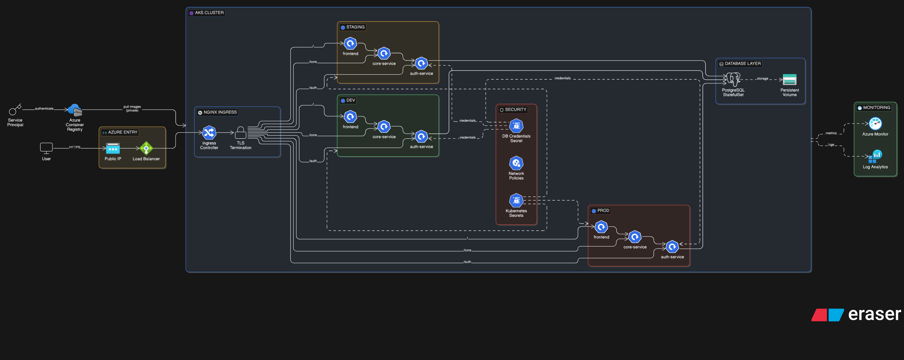
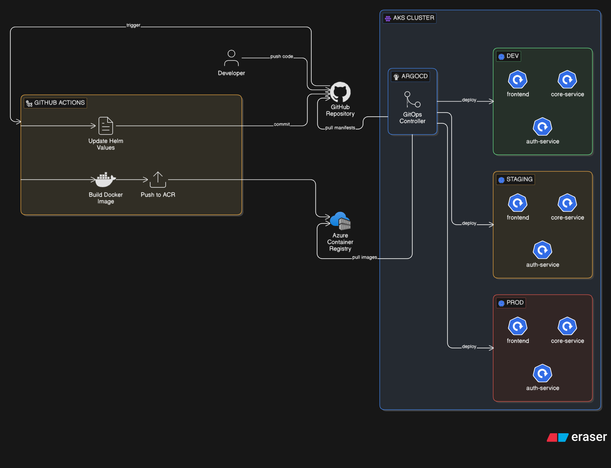

# Cloud Native DevOps Platform

This project is a comprehensive example of a modern, cloud-native application utilizing Microservices architecture, deployed on Kubernetes using GitOps principles with ArgoCD.



## 🚀 Project Overview

The **Cloud Native DevOps Platform** demonstrates a complete end-to-end DevOps pipeline and microservices architecture. It showcases how to build, containerize, and deploy a scalable application using industry-standard tools and practices.

### Key Features
- **Microservices Architecture**: Decoupled services for better scalability and maintainability.
- **Kubernetes Native**: Fully designed to run on Kubernetes clusters.
- **GitOps Deployment**: Automated continuous delivery using ArgoCD for Dev, Staging, and Production environments.
- **Infrastructure as Code**: Helm charts used for packaging and deploying services.
- **Scalable Database**: PostgreSQL integration for persistent data storage.

---

## 🏗️ Architecture Explained

The diagram above illustrates the system's architecture and traffic flow. Here is a breakdown of the components:

### 1. **Traffic Entry (Ingress)**
- **User Traffic**: All external requests enter the cluster through an **Ingress Controller**.
- **Routing**: The Ingress routes traffic based on the URL path to the appropriate service (e.g., `/auth` to Auth Service, `/core` to Core Service, `/` to Frontend).

### 2. **Microservices**
The application is composed of three main services:

*   **Frontend Service** (`frontend`)
    *   **Role**: Serves the user interface.
    *   **Tech Stack**: Nginx (serving static HTML/JS).
    *   **Function**: The entry point for users to interact with the platform.

*   **Authentication Service** (`auth-service`)
    *   **Role**: Manages user identity, login, and registration.
    *   **Tech Stack**: Node.js (NestJS) + TypeScript.
    *   **Function**: Issues JWT tokens and validates user credentials.

*   **Core Service** (`core-service`)
    *   **Role**: Handles the main business logic of the application.
    *   **Tech Stack**: Node.js (NestJS) + TypeScript + Prisma ORM.
    *   **Database**: Connects to **PostgreSQL** for storing application data.
    *   **Integration**: Communicates with the **Auth Service** to verify user tokens before processing requests.

### 3. **Infrastructure & DevOps**
*   **ArgoCD**: The GitOps controller that monitors this repository. It ensures the state of the Kubernetes cluster (Dev, Staging, Prod) matches the configuration in code.
*   **Helm**: Used to template and manage the Kubernetes manifests for each service, allowing for easy configuration across different environments.
*   **Azure Container Registry (ACR)**: Stores the Docker images for the services.

---

## 🛠️ Tech Stack

| Category | Technologies |
|----------|--------------|
| **Compute** | Kubernetes (K8s) |
| **CICD / GitOps** | ArgoCD, GitHub Actions (implied) |
| **Package Management** | Helm |
| **Backend** | Node.js, NestJS, TypeScript |
| **Frontend** | Nginx (Static) |
| **Database** | PostgreSQL |
| **Cloud Provider** | Azure (ACR, AKS implied) |

---

## 📂 Project Structure

```bash
├── services/               # Source code for microservices
│   ├── auth-service/       # Authentication service (NestJS)
│   ├── core-service/       # Business logic service (NestJS + Postgres)
│   └── frontend/           # Frontend web server (Nginx)
├── helm/                   # Helm charts for Kubernetes deployment
│   ├── auth-service/
│   ├── core-service/
│   └── frontend/
├── argocd-apps.yaml        # ArgoCD application definitions (Dev, Staging, Prod)
└── gitops/                 # GitOps configuration and manifests
```

## 🚀 Getting Started

To deploy this project, ensure you have a Kubernetes cluster and ArgoCD installed.

1.  **Clone the Repository**:
    ```bash
    git clone https://github.com/saeedgebaly/cloud-native-devops-platform-.git
    ```

2.  **Apply ArgoCD Application**:
    ```bash
    kubectl apply -f argocd-apps.yaml
    ```
    This will instruct ArgoCD to deploy the applications to your cluster based on the configuration in the `helm/` directory.

3.  **Access the Application**:
    Once deployed, the services will be available via the configured Ingress hosts (e.g., `*.nip.io` domains as defined in `values.yaml`).


